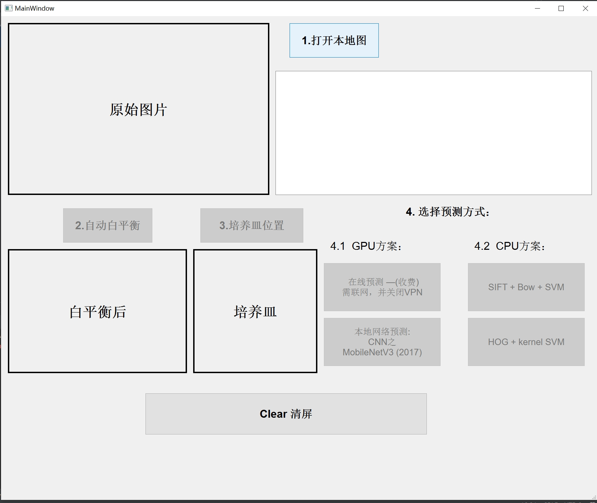
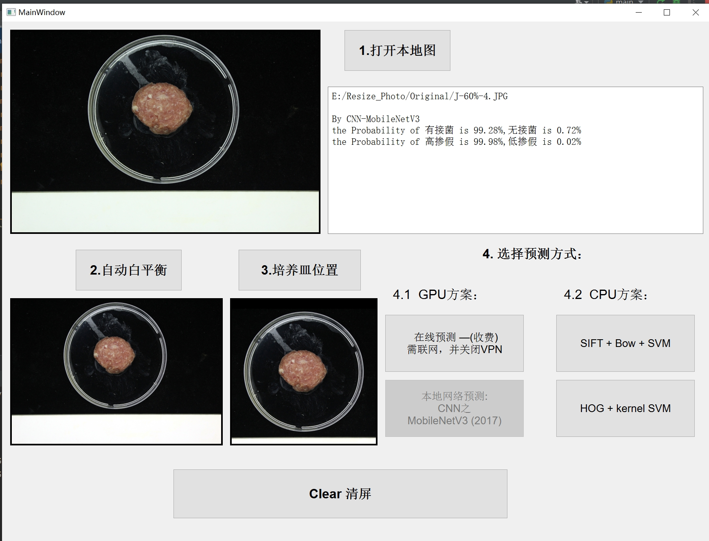
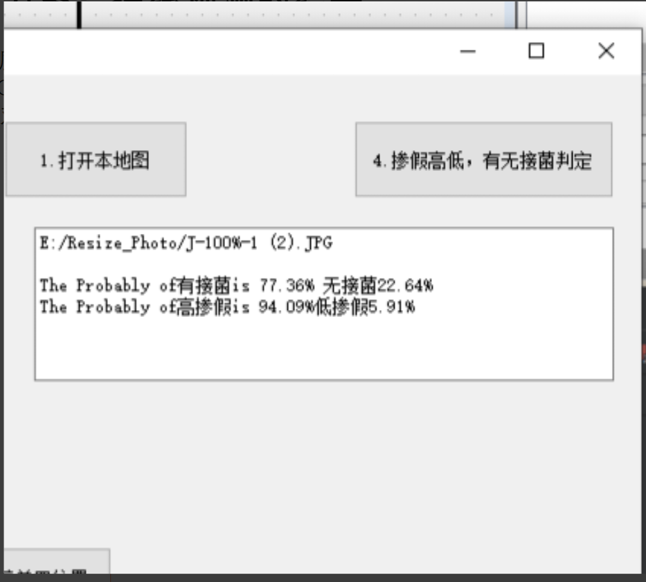
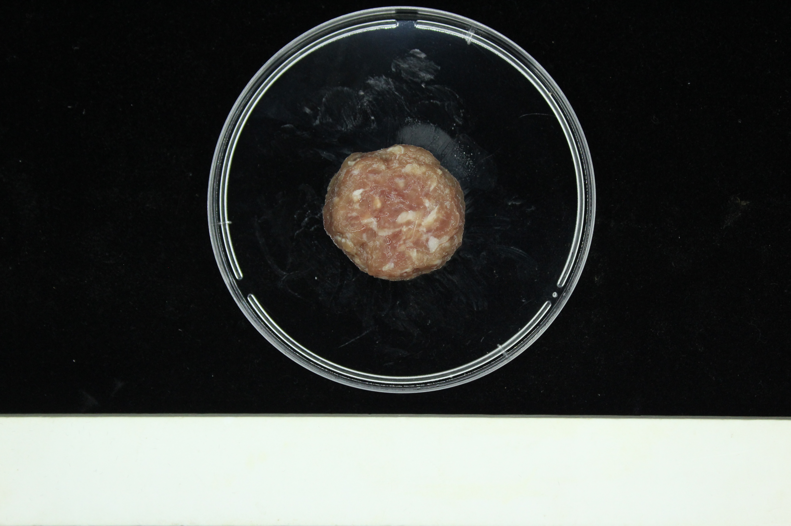

# identifying_mutton_fungal-infection_and_whether_adulterated_with_duck

> Notice: This Project is a subproject of my senior's  MSE degree's Paper ([palenn (Zhaochangtong) (github.com)](https://github.com/palenn)), it can run independently

My senior's MSE degree paper's content is identifing whether the mutton meatball is fungal-infected and whether the meatball is adulterated with duck by meanings of the fusion of E-nose and NIR(Near Infrared) features.

So I create  this repository , try to do the same identification using only the images of those meatballs.

## 

### Requirement:

python=3.7 

PaddlePadddle 2.4.2(must be 2.4.x ,pd.dataloader()has been refactored by Baidu since 2.5.0)

> [Install on Windows via PIP-Document-PaddlePaddle Deep Learning Platform](https://www.paddlepaddle.org.cn/documentation/docs/en/2.4/install/pip/windows-pip_en.html)

pip install the packages below:
paddlex

PyQt5

scikit-image

jsonpath

filelock
(Just pip install the packages above, nothing else needed)

### Introduction

1. MainWindow
 

2. MainWindow + MobileNetV3 Result

 

3. Baidu Paddle AI Studio , Online Predict Result
 

### DataSet:

all the pics are shot by a Canon EOS 600D ,  auto exposure and auto white balance

DataSet：https://pan.baidu.com/s/1UjLCDVn1Yed_4pqet-d26g?pwd=data 

 

the white balance is not accurate by the cam, but we put a white board in the pic as a pure white reference to calculate the white balance afterwards.

the meatball is placed in a round Petri dish, before inputing into the predict algorithm

， I use Hough Circle Transform to detect the round Petri dish and crop it out.

The Filename example : CK-100%-0 (2).JPG  or J-45%-2 (5).JPG :

__CK / J__ : **CK** means no fungal-infection, **J** means with fungal-infection

**0%~100%** : means the mutton meatball is  **0%~100%** adulterated with duck. For instance, 45% means the mutton meatball is 45% adulterated with duck.  

​	 I cut 0%~45% as "low"  and "60%~100%" as "high"

**0~5** : not invoved in this subproject, this number means the meatball  were placed in the petri dish for **0~5** days before this photo was shot. 

